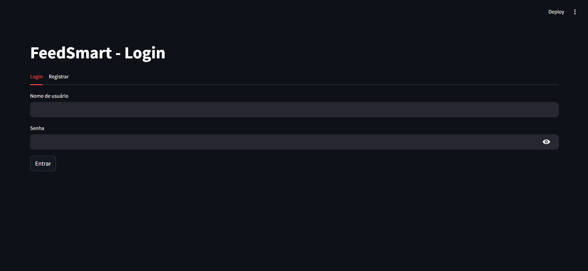
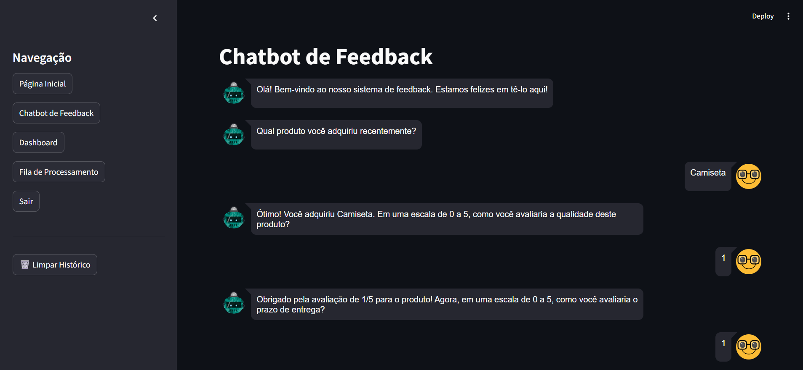
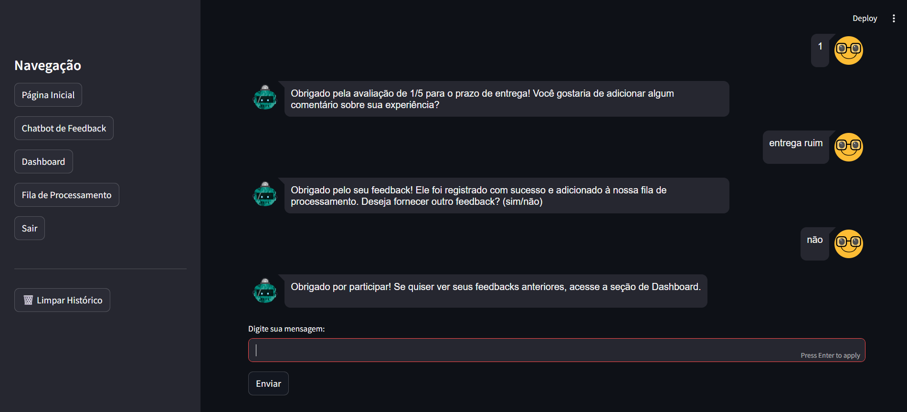
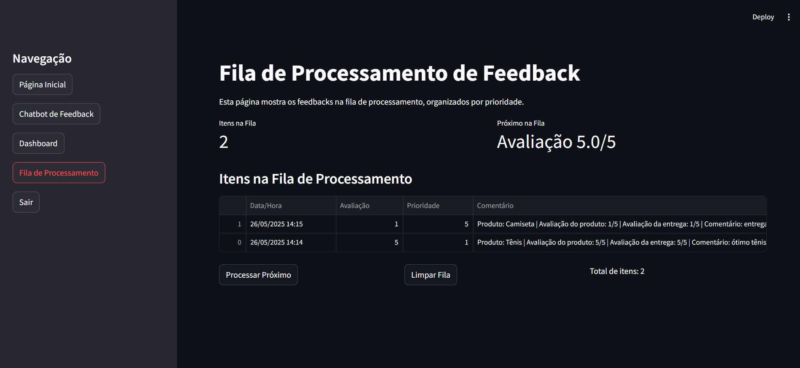

# 🚀 FeedSmart

**Resumo:** O FeedSmart é um sistema simples e funcional de coleta de feedbacks. Através de uma interface web intuitiva, permite que usuários enviem comentários e avaliações, armazenando os dados em um banco de dados local. Ideal para aplicações acadêmicas ou eventos internos, ele oferece uma forma prática de registrar e visualizar feedbacks.

---

## 🎯 Objetivo

O projeto FeedSmart tem como objetivo desenvolver uma aplicação que colete feedbacks de forma estruturada, utilizando uma interface web interativa, promovendo o aprendizado de frameworks web, manipulação de banco de dados, estrutura de dados e boas práticas de desenvolvimento.

Do ponto de vista de estrutura de dados, o sistema implementa:

Uma fila (queue) para gerenciar de forma sequencial e ordenada as solicitações de feedbacks, simulando uma entrada controlada e organizada de dados do usuário;

O algoritmo Merge Sort, aplicado para ordenar os índices dos feedbacks com base em suas notas de avaliação, retornando os índices do maior para o menor valor, permitindo a apresentação de resultados de forma eficiente e organizada.

Essas implementações fortalecem o uso de conceitos fundamentais de Estrutura de Dados na prática de desenvolvimento.

---

## 👨‍💻 Tecnologias Utilizadas

Liste as principais tecnologias, linguagens, frameworks e bibliotecas utilizadas:

- Python 3.12

- Streamlit

- SQLite
---

## 🗂️ Estrutura do Projeto

Caso o projeto tenha uma estrutura de pastas significativa, insira aqui um diagrama com os diretórios principais:

A estrutura a seguir é um exemplo. Vocês devem usar a estrutura do seu projeto obrigatóriamente. 
```
📦 FeedSmart
├── 📁 FeedSmart
│   ├── app.py                    
│   ├── feedback_app.db           
│   ├── requirements.txt          
│   ├── README.md                 
│
│   ├── 📁 data                   
│   │   └── feedback_data.csv
│
│   ├── 📁 utils                  
│   │   ├── __init__.py
│   │   ├── data_processing.py
│   │   ├── data_structures.py
│   │   ├── sorting.py
│   │   ├── visualization.py
│   │   └── 📁 __pycache__        
│   │       ├── __init__.cpython-312.pyc
│   │       ├── data_processing.cpython-312.pyc
│   │       ├── data_structures.cpython-312.pyc
│   │       ├── sorting.cpython-312.pyc
│   │       └── visualization.cpython-312.pyc

```

---

## ⚙️ Como Executar

### ✅ Rodando Localmente

1. Clone o repositório:

```
git clone https://github.com/GabrielSouzaC/FeedSmart.git
cd FeedSmart/FeedSmart

```

2. Crie o ambiente virtual e ative:

```
python -m venv venv
source venv/bin/activate  # ou venv\Scripts\activate no Windows
```

3. Instale as dependências:

```
pip install -r requirements.txt
```

4. Execute a aplicação:

```
streamlit run app.py
```

---

## 📸 Demonstrações

Inclua aqui prints, gifs ou vídeos mostrando a interface ou o funcionamento do sistema:






---

## 👥 Equipe

| Nome | GitHub |
|------|--------|
| Gabriel Souza de Carvalho  | [@GabrielSouzaC](https://github.com/GabrielSouzaC) |
| Carlos Eduardo Laera Prado | [@CarlosLaera](https://github.com/CarlosLaera) |
| Pedro Henrique dos Santos | [@pedrohenrys](https://github.com/pedrohenrys) |

---

## 🧠 Disciplinas Envolvidas

- Estrutura de Dados I
- Teoria dos Grafos
- Linguagens Formais e Autômatos
- Banco de Dados
- Programação com Python

---

## 🏫 Informações Acadêmicas

- Universidade: **Universidade Braz Cubas**
- Curso: **Ciência da Computação / Ciência da Computação**
- Semestre:  3º 
- Período: Noite
- Professora orientadora: **Dra. Andréa Ono Sakai**
- Evento: **Mostra de Tecnologia 1º Semestre de 2025**
- Local: Laboratório 12
- Datas: 05 e 06 de junho de 2025

---

## 📄 Licença

MIT License — sinta-se à vontade para utilizar, estudar e adaptar este projeto.
